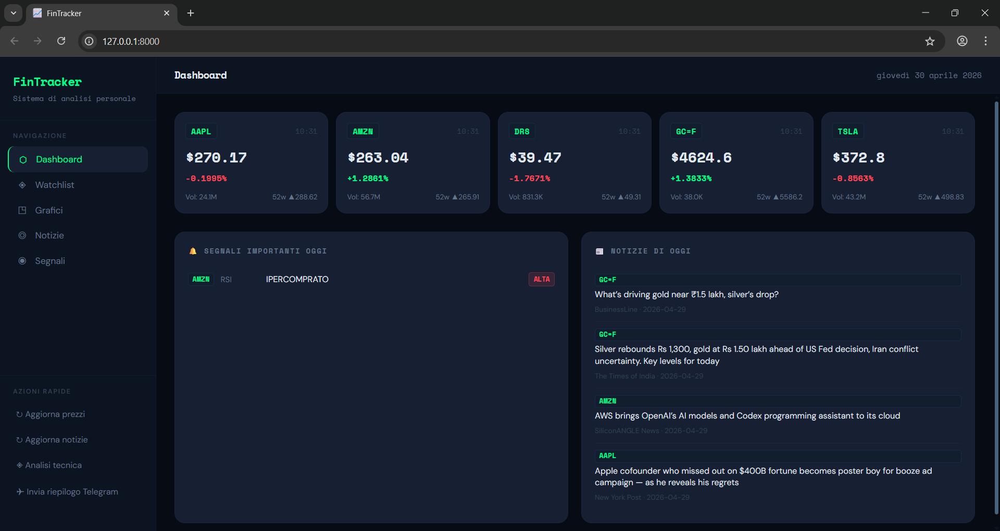
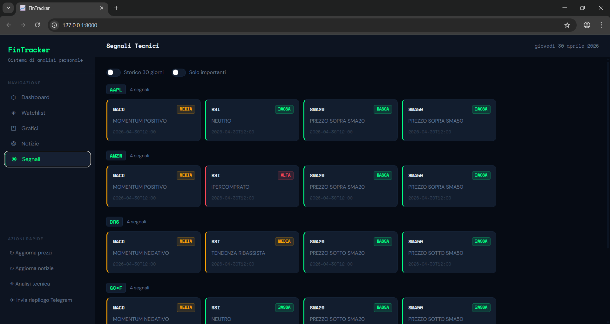

# FinTracker 📈

A personal financial monitoring system that tracks stocks, generates technical analysis signals, delivers daily briefings via Telegram, and provides an interactive web dashboard.

> Built as a personal project to combine backend development, financial data analysis, and automation.



---

## Features

- **Real-time market data** — Fetches live prices, volume, and 52-week highs/lows via Yahoo Finance
- **Technical analysis** — Automatically calculates RSI, MACD, SMA (20/50/200) and Bollinger Bands
- **Financial news** — Aggregates and filters relevant news per ticker via NewsAPI
- **Telegram alerts** — Sends a daily morning briefing with prices, signals, and news
- **Interactive dashboard** — Web UI with candlestick charts, volume, RSI, and signal tracking
- **Ticker search** — Search stocks, ETFs, crypto, and futures by name or symbol
- **Toggleable indicators** — Show/hide SMA, Bollinger Bands, Volume and RSI directly on the chart
- **Collapsible sidebar** — Clean UI with persistent state across sessions
- **Automated scheduling** — Daily routine runs automatically via Windows Task Scheduler
- **Portfolio analysis** — Jupyter Notebook with returns, risk, correlation and RSI backtest

---

## Screenshots

| Dashboard | Charts | Signals |
|-----------|--------|---------|
|  |  |  |

---

## Tech Stack

### Backend
| Technology | Purpose |
|---|---|
| **Python 3.12** | Core language |
| **FastAPI** | REST API framework |
| **PostgreSQL** | Production database |
| **psycopg2** | PostgreSQL driver |
| **yfinance** | Market data from Yahoo Finance |
| **pandas-ta** | Technical indicators calculation |
| **requests** | NewsAPI integration |

### Frontend
| Technology | Purpose |
|---|---|
| **HTML / CSS / JavaScript** | Vanilla frontend, no frameworks |
| **Lightweight Charts** | TradingView financial charts library |
| **Space Mono + DM Sans** | Typography |

### Analysis
| Technology | Purpose |
|---|---|
| **Jupyter Notebook** | Portfolio analysis and backtesting |
| **pandas / numpy** | Data manipulation |
| **matplotlib / seaborn** | Data visualisation |

### Infrastructure
| Technology | Purpose |
|---|---|
| **Uvicorn** | ASGI server |
| **pytest** | Automated testing (37 tests) |
| **python-dotenv** | Environment variable management |
| **Windows Task Scheduler** | Automated daily execution |

---

## Architecture

```
FinTracker/
│
├── backend/                    # FastAPI REST API
│   ├── main.py                 # App entry point, middleware, routing
│   └── routes/                 # One file per resource
│       ├── watchlist.py        # GET, POST, DELETE /api/watchlist
│       ├── prezzi.py           # GET, POST /api/prezzi
│       ├── notizie.py          # GET, POST /api/notizie
│       ├── segnali.py          # GET, POST /api/segnali
│       ├── storico.py          # GET /api/storico/{ticker}
│       └── telegram.py         # POST /api/telegram/riepilogo
│
├── database/                   # Data layer — PostgreSQL
│   ├── connection.py           # Connection management
│   ├── migrations.py           # Table creation on startup
│   └── repositories/           # All SQL queries, one file per table
│       ├── watchlist.py
│       ├── prezzi.py
│       ├── notizie.py
│       └── segnali.py
│
├── modules/                    # Business logic
│   ├── market_data.py          # Yahoo Finance data fetching
│   ├── news.py                 # NewsAPI integration + relevance filter
│   ├── indicators.py           # RSI, MACD, SMA, Bollinger Bands
│   └── telegram_bot.py         # Daily briefing composition and delivery
│
├── frontend/                   # Static web UI
│   ├── index.html
│   ├── css/style.css
│   └── js/
│       ├── api.js              # Centralised API calls
│       └── dashboard.js        # UI logic and chart rendering
│
├── notebooks/
│   └── FinTracker_Analysis.ipynb  # Portfolio analysis and RSI backtest
│
├── tests/                      # Automated tests
│   ├── test_indicators.py      # RSI, MACD, SMA, Bollinger Bands
│   ├── test_repositories.py    # Database operations
│   └── test_modules.py         # Business logic and news filtering
│
├── main.py                     # CLI interface for manual operations
└── scheduler.py                # Daily automation script
```

### Design Decisions

**Repository Pattern** — All database queries are centralised in `database/repositories/`. No other module writes SQL directly. This makes queries easy to find, test, and maintain. Migrating from SQLite to PostgreSQL required changes only in this layer.

**Separation of concerns** — `modules/` contains business logic with no knowledge of the database or the HTTP layer. Routes delegate to modules; modules delegate to repositories.

**Relevance filtering** — News articles are filtered before saving: only articles whose title or description contains a keyword related to the ticker are stored, avoiding generic noise.

**Daily deduplication** — Technical signals use `ON CONFLICT DO UPDATE` to avoid duplicates when analysis runs multiple times on the same day.

---

## API Endpoints

| Method | Endpoint | Description |
|--------|----------|-------------|
| `GET` | `/api/watchlist/` | Get all tracked tickers |
| `GET` | `/api/watchlist/cerca/{query}` | Search tickers by name or symbol |
| `POST` | `/api/watchlist/{ticker}` | Add ticker (validates on Yahoo Finance) |
| `DELETE` | `/api/watchlist/{ticker}` | Remove ticker and all related data |
| `GET` | `/api/prezzi/` | Get latest prices for all tickers |
| `POST` | `/api/prezzi/aggiorna` | Fetch fresh prices from Yahoo Finance |
| `GET` | `/api/notizie/` | Get news (filterable by ticker and date) |
| `POST` | `/api/notizie/aggiorna` | Fetch fresh news from NewsAPI |
| `GET` | `/api/segnali/` | Get technical signals |
| `POST` | `/api/segnali/analisi` | Run full technical analysis |
| `GET` | `/api/storico/{ticker}` | Get OHLCV + Bollinger Bands data for charts |
| `POST` | `/api/telegram/riepilogo` | Send daily briefing via Telegram |

---

## Technical Indicators

| Indicator | Signal Logic |
|---|---|
| **RSI (14)** | > 70 = Overbought (HIGH), < 30 = Oversold (HIGH), 40–60 = Neutral |
| **MACD (12/26/9)** | MACD > Signal = Positive momentum, MACD < Signal = Negative momentum |
| **SMA 20/50/200** | Price above/below each moving average |
| **Bollinger Bands (20, 2σ)** | Price at upper band = HIGH, price at lower band = HIGH |

---

## Tests

37 automated tests covering the core logic:

```bash
pytest tests/ -v
```

| File | What it tests |
|---|---|
| `test_indicators.py` | RSI overbought/oversold, SMA above/below, Bollinger signal generation, NaN handling |
| `test_repositories.py` | DB insert/select/delete, duplicate handling, query filters |
| `test_modules.py` | Price fetching, news relevance filtering, query construction |

---

## Jupyter Notebook — Portfolio Analysis

The notebook `notebooks/FinTracker_Analysis.ipynb` provides a full quantitative analysis of the watchlist:

- **Cumulative returns** — How much each ticker gained or lost over 2 years
- **Monthly return heatmap** — Visual breakdown of returns by month
- **Risk analysis** — Annualised volatility and Sharpe Ratio per ticker
- **Correlation matrix** — How diversified the portfolio actually is
- **RSI backtest** — Tests the buy < 30 / sell > 70 strategy vs Buy & Hold
- **Automated summary** — Best performer, lowest volatility, best Sharpe

---

## Getting Started

### Prerequisites

- Python 3.12+
- PostgreSQL 14+
- A [NewsAPI](https://newsapi.org) key (free tier)
- A Telegram bot token (via [@BotFather](https://t.me/BotFather))

### Installation

```bash
# 1. Clone the repository
git clone https://github.com/YOUR_USERNAME/FinTracker.git
cd FinTracker

# 2. Create and activate virtual environment
python -m venv venv
venv\Scripts\activate        # Windows
source venv/bin/activate     # macOS/Linux

# 3. Install dependencies
pip install -r requirements.txt

# 4. Configure environment variables
cp .env.example .env
# Edit .env with your credentials

# 5. Create the database
# Create a PostgreSQL database named 'fintracker', then run migrations:
python main.py --migra

# 6. Start the server
uvicorn backend.main:app --reload --port 8000
```

Open `http://localhost:8000` in your browser.

### Environment Variables

```env
# Database
DB_HOST=localhost
DB_PORT=5432
DB_NAME=fintracker
DB_USER=postgres
DB_PASSWORD=your_password

# Telegram
TELEGRAM_TOKEN=your_bot_token
TELEGRAM_CHAT_ID=your_chat_id

# NewsAPI
NEWS_API_KEY=your_newsapi_key

# Monitoring
VARIAZIONE_SOGLIA=3.0
```

### CLI Usage

```bash
python main.py --migra              # Run database migrations
python main.py --watchlist          # Show current watchlist
python main.py --aggiungi AAPL      # Add a ticker
python main.py --rimuovi AAPL       # Remove a ticker
python main.py --aggiorna-prezzi    # Fetch latest prices
python main.py --analisi            # Run technical analysis
python main.py --telegram           # Send Telegram briefing
```

---

## Automated Daily Briefing

The `scheduler.py` script runs the full daily routine in sequence:

```
1. Update prices      (Yahoo Finance)
2. Update news        (NewsAPI)
3. Technical analysis (RSI, MACD, SMA, Bollinger)
4. Send Telegram      (prices + signals + news)
```

On Windows, configure Task Scheduler to run `avvia_fintracker.bat` every morning at your preferred time. The system runs independently of whether the dashboard is open.

---

## Data Flow

```
Yahoo Finance ──► market_data.py ──► repositories/prezzi.py ──► PostgreSQL
                                                                      │
NewsAPI ─────────► news.py ──────────► repositories/notizie.py ───────┤
                                                                      │
                   indicators.py ───► repositories/segnali.py ────────┤
                                                                      │
                                      FastAPI routes ◄────────────────┘
                                             │
                                      frontend/index.html
                                             │
                                      Telegram Bot
```

---

## What I Learned

- Designing a **layered architecture** (routes → modules → repositories) that separates HTTP, business logic, and data concerns
- Migrating from **SQLite to PostgreSQL** and handling type differences (numpy types, TIMESTAMPTZ vs TIMESTAMP, DISTINCT ON)
- Building a **vanilla JS frontend** that communicates with a REST API without frameworks
- Implementing **financial indicators** from scratch (RSI, MACD, SMA, Bollinger Bands) and understanding their trading logic
- Using **PostgreSQL-specific features**: `DISTINCT ON`, `ON CONFLICT DO UPDATE`, `INTERVAL`, `SERIAL`, unique functional indexes
- Writing **37 automated tests** with pytest and unittest.mock, including database mocking
- Performing **quantitative portfolio analysis** with pandas: returns, volatility, Sharpe Ratio, correlation matrices and strategy backtesting

---

## License

MIT License — see [LICENSE](LICENSE) for details.
